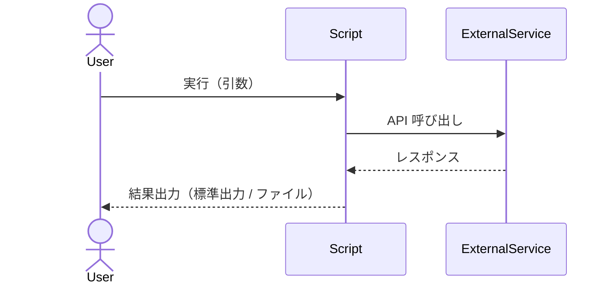

## 背景・課題

<!-- 現状の手作業・非効率な運用の問題点・自動化が必要な理由 -->

## 目的・ゴール

<!-- スクリプト完成後に自動化・解決されること / Definition of Done -->

- [ ] 

## 作成するファイル一覧

<!-- `docs/directory-structure.md` のルールに従って記載する -->
<!-- デプロイに不要なファイルは記載しない -->

| ファイルパス | 種別 | 用途 |
|---|---|---|
|   | 新規/更新 |   |

## 想定フォルダ構成

<!-- `docs/directory-structure.md` のルールに従って記載する -->
<!-- 例: スクリプトは機能ディレクトリ/scripts、テストは機能ディレクトリ/tests -->

```text
<機能ディレクトリ>/
    scripts/
        <script-file>
    tests/
        <test-file>
    README.md
```

## 設定項目一覧（デプロイ必須のみ・機密区分）

<!-- デプロイ必須の設定のみ記載する -->
<!-- 機密区分は最低でも「公開可 / 内部情報」を付与する -->

| 設定項目 | 取得方法 | 必須 | 機密区分 | 説明 |
|---------|---------|------|---------|------|
|         |         |      | 公開可/内部情報 | |

### 機密値の取り扱いルール

- 機密区分が `内部情報` の値は、Issue 本文・公開コメントに実値を記載しない
- 実値の保存は平文コミットを避ける（例: SSM Parameter Store / Secrets Manager）

## 依存関係・前提条件

<!-- 先行して完了している必要がある Issue / スクリプト / 環境設定を記載する -->

| 種別 | 内容 | 状態 |
|------|------|------|
| 前提 Issue | <!-- #番号 タイトル --> | open/closed |
| 前提スクリプト/モジュール | <!-- 利用する既存ライブラリ・スクリプト --> | 有/無 |
| 前提条件 | <!-- 環境変数の設定、AWS 認証情報の準備等 --> |  |

## 対象言語・実行環境

| 項目 | 内容 |
|------|------|
| 言語 | <!-- Python / Bash / PowerShell など --> |
| バージョン | <!-- 例: Python 3.12, Bash 5.x --> |
| 実行 OS | <!-- Linux / Windows / macOS --> |
| 実行基盤 | <!-- ローカル / EC2 / Lambda / GitHub Actions / Container など --> |
| 依存ツール | <!-- AWS CLI, jq, terraform など --> |

## インターフェース設計

### 引数・オプション

| 引数/オプション | 型 | 必須 | デフォルト値 | 説明 |
|--------------|-----|------|------------|------|
|              |     |      |            |      |

### 入出力仕様

| 項目 | 形式 | 説明 |
|------|------|------|
| 入力 |      |      |
| 出力 |      |      |
| 標準出力 |   |      |
| 標準エラー出力 | |    |
| 終了コード | 0: 正常, 1: 異常 |  |

### 副作用・外部連携

<!-- ファイル書き込み・API 呼び出し・DB 更新・通知送信など -->
<!-- BP(備考欄に記載): https://docs.aws.amazon.com/boto3/latest/guide/configuration.html -->

- 

## 処理フロー

<!-- Mermaid シーケンス図でメイン処理の流れを記述する -->
<!-- 登場人物（Actor）はスクリプト・呼び出し元・外部サービス等に合わせて変更する -->



## モジュール・関数設計

<!-- 主要な関数/クラスの責務を列挙 -->

| 関数/クラス名 | 責務 | 入力 | 出力 |
|-------------|------|------|------|
|             |      |      |      |

## 設定・シークレット管理

<!-- 環境変数・設定ファイル・Secrets Manager / SSM Parameter Store の利用方針 -->
<!-- BP(備考欄に記載): https://docs.aws.amazon.com/secretsmanager/latest/userguide/best-practices.html -->
<!-- BP(備考欄に記載): https://docs.aws.amazon.com/systems-manager/latest/userguide/systems-manager-parameter-store.html -->
<!-- BP(備考欄に記載): https://12factor.net/config -->

| 設定項目 | 取得方法 | 必須 | 説明 |
|---------|---------|------|------|
|         |         |      |      |

## エラーハンドリング・リトライ設計

<!-- 想定される異常系・例外と対処方針 -->
<!-- BP(対処方針列に記載): https://docs.python.org/3/library/exceptions.html -->
<!-- BP(対処方針列に記載): https://docs.python.org/3/howto/logging.html#when-to-use-logging -->
<!-- BP(対処方針列に記載): https://aws.amazon.com/builders-library/timeouts-retries-and-backoff-with-jitter/ -->

| 異常系 | 対処方針 | 終了コード |
|-------|---------|----------|
|       |         |           |

## ログ設計

<!-- ログレベル・出力先・フォーマット・ローテーション -->
<!-- BP(各項目直下に記載): https://docs.python.org/3/howto/logging.html -->
<!-- BP(各項目直下に記載): https://docs.python.org/3/howto/logging-cookbook.html -->
<!-- BP(各項目直下に記載): https://docs.aws.amazon.com/lambda/latest/dg/python-logging.html -->

- **ログレベル**: <!-- DEBUG / INFO / WARNING / ERROR -->
- **出力先**: <!-- 標準出力 / ファイル / CloudWatch Logs など -->
- **フォーマット**: <!-- 例: `[%(asctime)s] %(levelname)s %(message)s` -->

## 監視・アラート設計

<!-- メトリクス出力・アラーム・通知先（Lambda/EC2 実行時は特に考慮） -->
<!-- 対象外の場合は N/A または「対象外（理由）」とし、設定項目名は記載しない -->
<!-- BP(備考欄に記載): https://docs.aws.amazon.com/wellarchitected/latest/operational-excellence-pillar/welcome.html -->
<!-- BP(備考欄に記載): https://docs.aws.amazon.com/AmazonCloudWatch/latest/monitoring/publishingMetrics.html -->

| メトリクス / ログパターン | 閾値 / 条件 | アクション | 通知先 |
|--------------------|-----------|---------|--------|
|                    |           |         |       |

## パフォーマンス・タイムアウト設計

<!-- 実行時間・メモリ使用量・並列化・ Lambda 制限の考慮 -->
<!-- BP(備考欄に記載): https://docs.aws.amazon.com/lambda/latest/dg/configuration-memory.html -->
<!-- BP(備考欄に記載): https://aws.amazon.com/builders-library/timeouts-retries-and-backoff-with-jitter/ -->

| 項目 | 目標値 | 備考 |
|------|--------|------|
| 最大実行時間 | <!-- 例: 5 分、Lambda 上限 15 分 --> | |
| メモリ使用量 | <!-- 例: 512 MB --> | |
| 並列実行 | <!-- 対応 / 非対応 --> | |
| リトライ回数 | <!-- 例: 最大3回 --> | |
| タイムアウト | <!-- 各外部呼び出しのタイムアウト値 --> | |

## テスト・検証方針

### 静的解析・Lint

<!-- コードの構文・スタイル・型チェック -->
<!-- 非採用の言語/ツール行は削除せず、対象列に `N/A（本Issueでは非採用）` を明記する -->
<!-- BP(ツール列の備考に記載): https://docs.astral.sh/ruff/ -->
<!-- BP(ツール列の備考に記載): https://mypy.readthedocs.io/en/stable/best_practices.html -->
<!-- BP(ツール列の備考に記載): https://www.shellcheck.net/ -->

| ツール | 対象言語 | 用途 | 実行タイミング |
|-------|---------|------|-------------|
| `flake8` / `ruff` | Python | スタイル・構文チェック | PR 時 |
| `black` | Python | フォーマット統一 | PR 時 |
| `mypy` | Python | 型チェック | PR 時 |
| `shellcheck` | Bash/Shell | シェルスクリプト静的解析 | PR 時 |
| `PSScriptAnalyzer` | PowerShell | 静的解析 | PR 時 |

**CI 実装（GitHub Actions）:**

- [ ] `.github/workflows/` に lint ワークフローを作成する
- [ ] 対象言語に応じたツールをインストール・実行するステップを追加する
- [ ] `on: pull_request` トリガーで自動実行されるよう設定する
- [ ] lint エラー時に PR をブロックするブランチ保護ルールを設定する

### ユニットテスト・モックテスト

<!-- 外部依存をモック化して単体で検証する -->
<!-- 非採用の言語/ツール行は削除せず、対象列に `N/A（本Issueでは非採用）` を明記する -->
<!-- BP(ツール列の備考に記載): https://docs.pytest.org/en/stable/how-to/monkeypatch.html -->
<!-- BP(ツール列の備考に記載): https://docs.getmoto.org/en/latest/docs/getting_started.html -->
<!-- BP(ツール列の備考に記載): https://pytest-mock.readthedocs.io/en/latest/ -->

| ツール | 対象言語 | 用途 | モック対象 |
|-------|---------|------|---------|
| `pytest` + `pytest-mock` | Python | ユニットテスト・モック | 外部 API, ファイル I/O, boto3 |
| `moto` | Python | AWS API モック | S3, Lambda, DynamoDB 等 |
| `unittest.mock` | Python | 標準ライブラリモック | 任意の関数・クラス |
| `bats` | Bash/Shell | シェルスクリプトテスト | コマンド出力・終了コード |
| `Pester` | PowerShell | PowerShell ユニットテスト | コマンドレット・関数 |

```
# 例: pytest を使ったモックテスト対象
- [ ] 正常系: 期待どおりの出力・戻り値
- [ ] 異常系: 例外・エラーハンドリングの動作
- [ ] 境界値: 空入力・最大値・最小値
- [ ] 外部依存モック: API 呼び出しのモック化
```

**CI 実装（GitHub Actions）:**

- [ ] `.github/workflows/` にテストワークフローを作成する
- [ ] `pytest --junitxml=report.xml` でテストを実行し JUnit 形式で出力する
- [ ] `actions/upload-artifact` でテスト結果レポートを保存する
- [ ] カバレッジレポートを生成し閾値を設定する（例: `--cov --cov-fail-under=80`）
- [ ] PR トリガーでテスト失敗時にマージをブロックするよう設定する

### 結合テスト（実環境・ステージング）

<!-- 実際の環境・依存サービスと組み合わせた動作確認 -->
<!-- 非採用の実行方式/環境の手順は削除せず、`N/A（本Issueでは非採用）` として残す -->

- [ ] dev/staging 環境で実行し期待どおりの出力を確認する
- [ ] 外部サービス（API, AWS 等）との疎通確認
- [ ] 実際の入力データを使ったエンドツーエンド確認
- [ ] ログ出力が設計どおりであることを確認する

### 受け入れ基準

<!-- Issue クローズの条件 -->

- [ ] 
- [ ] 

## 実施内容

<!-- 実装タスクのチェックリスト -->

- [ ] 
- [ ] 

## デプロイ・配置方針

<!-- スクリプトの配置場所・実行権限・呼び出し方法 -->
<!-- 配置場所は `docs/directory-structure.md` に従う -->
<!-- BP(備考欄に記載): https://docs.aws.amazon.com/lambda/latest/dg/deploying-lambda-apps.html -->

| パラメータ | 値 | 備考 |
|---------|-----|------|
| 配置パス |     |      |
| 実行権限 | <!-- chmod 755 など --> |  |
| 呼び出し方法 | <!-- cron / EventBridge / 手動 / GitHub Actions など --> | |

**デプロイ手順:**

1. 
2. 

**ロールバック手順:**

1. 

## 参考情報

### 関連 Issue

<!-- 類似 Issue が見つかった場合に記載 -->
<!-- - #<番号> <タイトル> (<状態>) - <URL> -->

### 関連ライブラリ・ドキュメント

- 
