# EC2 踏み台サーバーとセカンダリサーバーの構成

このTerraform構成は、AWSに踏み台ホストとセカンダリサーバーを作成します。以下のリソースが含まれています：

## リソース構成

### ネットワークリソース
- **VPC**: CIDRブロック10.0.0.0/16
- **パブリックサブネット1**: 踏み台ホスト用（10.0.0.0/24）
- **パブリックサブネット2**: セカンダリサーバー用（10.0.1.0/24）
- **インターネットゲートウェイ**: インターネット接続用
- **ルートテーブル**: インターネットゲートウェイへのルート（0.0.0.0/0）
- **セキュリティグループ1**: 踏み台ホスト用（クライアントのグローバルIPからのSSH許可）
- **セキュリティグループ2**: セカンダリサーバー用（踏み台ホストからのみSSH許可）

### コンピューティングリソース
- **踏み台ホストEC2インスタンス**：
  - Amazon Linux 2 AMI（SSMパラメータストアから動的取得）
  - 固定プライベートIP: 10.0.0.10
  - パブリックIPアドレス自動割り当て
  - クライアントのグローバルIPからのSSHアクセス許可
  - 専用ネットワークインターフェース使用

- **セカンダリサーバーEC2インスタンス**：
  - Amazon Linux 2 AMI（SSMパラメータストアから動的取得）
  - 固定プライベートIP: 10.0.1.10
  - パブリックIPアドレス自動割り当て
  - 踏み台ホストからのみSSHアクセス可能（セキュリティグループで制限）
  - 専用ネットワークインターフェース使用
  - 初期設定用のブートストラップスクリプト実行

### アクセス管理
- **キーペア**: 両インスタンスへのSSHアクセス用の共通キーペア

## セキュリティ設計

- セカンダリサーバーは踏み台ホストを経由してのみアクセス可能
- クライアントのグローバルIPアドレスを動的に取得し、踏み台ホストへのアクセスを制限
- 各インスタンスは専用のセキュリティグループで保護

## 使用方法

この構成をデプロイするには、メインのREADME.mdに記載されている手順に従ってください。