# Windows EC2 インスタンス構成

このTerraform構成は、AWSにWindows Server EC2インスタンスを作成します。以下のリソースが含まれています：

## リソース構成

### ネットワークリソース
- **VPC**: CIDRブロック10.0.0.0/16
- **パブリックサブネット**: Windows Server用（10.0.0.0/24）
- **インターネットゲートウェイ**: インターネット接続用
- **ルートテーブル**: インターネットゲートウェイへのルート（0.0.0.0/0）
- **セキュリティグループ**: クライアントのグローバルIPからのTCPアクセス許可（ポート0-3389）

### コンピューティングリソース
- **Windows Server EC2インスタンス**：
  - Windows Server 2019 AMI（AWSから最新版を動的取得）
  - 固定プライベートIP: 10.0.0.10
  - パブリックIPアドレス自動割り当て
  - 専用ネットワークインターフェース使用
  - RDPアクセス（ポート3389）

### アクセス管理
- **キーペア**: Windowsインスタンスへのアクセス用

## セキュリティ設計

- クライアントのグローバルIPアドレスを動的に取得し、RDPアクセスを制限
- セキュリティグループでTCPポート0-3389を許可（RDPおよびその他のサービス用）
- 全てのアウトバウンド通信を許可

## 使用方法

この構成をデプロイするには、メインのREADME.mdに記載されている手順に従ってください。