# Minikube、OpenSearch、Prometheus構成

このTerraform構成は、Minikube、OpenSearch、PrometheusがインストールされたEC2インスタンスを作成します。以下のリソースが含まれています：

## リソース構成

### ネットワークリソース
- **VPC**: 設定可能なCIDRブロック（デフォルト: 10.0.0.0/16）
- **パブリックサブネット**: 設定可能なCIDRブロック
- **インターネットゲートウェイ**: インターネット接続用
- **ルートテーブル**: インターネットゲートウェイへのルート（0.0.0.0/0）
- **セキュリティグループ**: クライアントのグローバルIPからのSSHアクセス許可

### コンピューティングリソース
- **EC2インスタンス**：
  - Amazon Linux 2 AMI（SSMパラメータストアから動的取得）
  - 専用ネットワークインターフェース使用
  - パブリックIPアドレス自動割り当て
  - DockerとMinikubeの自動インストール
  - IAMインスタンスプロファイル付与

### Kubernetesリソース（Minikube上）
- **OpenSearchクラスター**：
  - OpenSearchリーダーノード（opensearch-leader.yaml）
  - OpenSearchデータノード（opensearch-data.yaml）
  - スナップショットリポジトリ登録（register-snapshot-repository.yaml）
  - SLM（スナップショットライフサイクル管理）設定（register-slm.yaml）

- **Prometheusモニタリング**：
  - メトリクス収集とモニタリング機能

### IAMリソース
- **IAMロール**: EC2インスタンス用の実行ロール
- **IAMインスタンスプロファイル**: EC2インスタンスへのロール付与

### アクセス管理
- **キーペア**: EC2インスタンスへのSSHアクセス用

## セキュリティ設計

- クライアントのグローバルIPアドレスを動的に取得し、SSHアクセスを制限
- セキュリティグループでポート22（SSH）のみ許可
- 全てのアウトバウンド通信は許可
- IAMロールによる適切な権限管理

## デプロイ後のアクセス

デプロイ完了後、以下にアクセスできます：
- **OpenSearchダッシュボード**: Kubernetesクラスター内で実行
- **Prometheusモニタリングインターフェース**: メトリクス収集とアラート機能

## 使用方法

この構成をデプロイするには、メインのREADME.mdに記載されている手順に従ってください。

追加情報については、`docs`ディレクトリのドキュメントを参照してください。