# MySQL RDS インスタンス構成

このTerraform構成は、AWSにMySQL RDSインスタンスを作成します。以下のリソースが含まれています：

## リソース構成

### ネットワークリソース
- **VPC**: CIDRブロック10.0.0.0/16
- **DBサブネット1**: ap-northeast-1c（10.0.1.0/24）
- **DBサブネット2**: ap-northeast-1a（10.0.2.0/24）
- **DBサブネットグループ**: マルチAZ配置用のサブネットグループ
- **セキュリティグループ**: RDSインスタンス用のアクセス制御

### データベースリソース
- **MySQL RDSインスタンス**：
  - エンジン: MySQL 8.0
  - インスタンスクラス: db.t3.micro
  - ストレージ: 20GB GP3（汎用SSD）
  - マルチAZ配置: DBサブネットグループを使用
  - 識別子: 動的生成（タグ名ベース）
  - 最終スナップショット: スキップ設定

### セキュリティ設計
- **セキュリティグループ**: RDS専用のアクセス制御ルール
- **ネットワーク分離**: 専用のDBサブネット内に配置
- **マルチAZ**: 異なるアベイラビリティゾーンでの冗長性確保

### 認証情報
- **ユーザー名**: admin（デフォルト）
- **パスワード**: password（デフォルト）

## セキュリティ注意事項

⚠️ **重要**: デフォルト設定では、ユーザー名に「admin」、パスワードに「password」を使用しています。本番環境では、以下の対策を必ず実施してください：

1. 強力なパスワードに変更
2. AWS Secrets Managerの使用を検討
3. セキュリティグループでアクセス元IPを制限
4. 暗号化の有効化
5. バックアップとモニタリングの設定

## 使用方法

この構成をデプロイするには、メインのREADME.mdに記載されている手順に従ってください。