# Aurora MySQL RDS クラスター構成

このTerraform構成は、AWSにAurora MySQL RDSクラスターを作成します。以下のリソースが含まれています：

## リソース構成

### ネットワークリソース
- **VPC**: CIDRブロック10.0.0.0/16
- **DBサブネット1**: アベイラビリティゾーン1c（10.0.1.0/24）
- **DBサブネット2**: アベイラビリティゾーン1a（10.0.2.0/24）
- **DBサブネットグループ**: 高可用性のための複数AZ構成
- **セキュリティグループ**: RDSクラスター用のアクセス制御

### データベースリソース
- **Aurora MySQL RDSクラスター**：
  - Aurora MySQL 8.0エンジン（バージョン8.0.mysql_aurora.3.05.2）
  - データベース名: "mydb"
  - バックアップ保持期間: 1日
  - 優先バックアップウィンドウ: 07:00-09:00 UTC
  - 最終スナップショットをスキップ

- **RDSクラスターインスタンス**：
  - db.t3.mediumインスタンスクラス
  - クラスターと同じエンジンとバージョン
  - 高可用性のためのDBサブネットグループ使用

## セキュリティ設計

- データベースは専用のセキュリティグループで保護
- 複数のアベイラビリティゾーンにまたがるサブネット構成で高可用性を実現
- DBサブネットグループによりデータベースアクセスを制御

## 使用方法

この構成をデプロイするには、メインのREADME.mdに記載されている手順に従ってください。

注意: デフォルト設定では、ユーザー名に"foo"、パスワードに"must_be_eight_characters"を使用しています。本番環境では、これらの値を変更し、安全に保存してください。