# Windows Managed Instance Setup

This Terraform configuration creates a Windows Server 2022 EC2 instance managed by AWS Systems Manager, with the following resources:

## Resource Configuration

### Network Resources
- VPC
- Public subnet
- Internet Gateway
- Route Table with routes to the Internet Gateway
- Security Group for the Windows instance

### Compute Resources
- Windows Server EC2 instance:
  - Windows Server 2022 AMI (latest version from AWS)
  - IAM instance profile for Systems Manager management
  - Key pair for direct access if needed

### IAM Resources
- IAM role with EC2 trust relationship
- IAM policy attachment for AmazonSSMManagedInstanceCore
- IAM instance profile for the EC2 instance

## Usage

Follow the instructions in the main README.md file to deploy this configuration.

After deployment, you can manage this Windows instance through AWS Systems Manager without needing direct RDP access, although RDP is still available using the key pair if required.