# Linux マネージドノード設定

このTerraform構成は、AWS Systems Managerで管理されるLinux EC2インスタンスを監視機能付きで作成します。以下のリソースが含まれています：

## Resource Configuration

### Network Resources
- VPC
- Public subnet
- Internet Gateway
- Route Table with routes to the Internet Gateway
- Security Group for the Linux instance

### Compute Resources
- Linux EC2 instance:
  - Amazon Linux AMI (specified via variable)
  - IAM instance profile for Systems Manager management
  - Key pair for SSH access if needed

### IAM Resources
- IAM role with EC2 trust relationship
- IAM policy attachment for AmazonSSMManagedInstanceCore
- IAM instance profile for the EC2 instance

### Monitoring Resources
- Installation scripts for:
  - Amazon CloudWatch Agent
  - Zabbix Agent 6.0

## Usage

Follow the instructions in the main README.md file to deploy this configuration.
この構成をデプロイするには、メインのREADME.mdに記載されている手順に従ってください。
After deployment, you can:
