# CloudFormation サンプル構成



## 概要

このディレクトリには、CloudFormationテンプレートのサンプル構成が含まれています。基本的なEC2インスタンスとネットワーク構成を定義しています。

## 構成要素

### ネットワーク
- **VPC**: 10.0.0.0/16のCIDRブロックを持つVirtual Private Cloud
- **セキュリティグループ**: SSH接続（ポート22）を許可するセキュリティグループ

### コンピューティング
- **EC2インスタンス**: t2.microインスタンスタイプのEC2インスタンス
- **キーペア**: SSH接続用のキーペア（my-key-pair）

## ファイル構成

```
011.cfn/
├── cfn/
│   ├── ec2-latest-image.yaml    # 最新AMI IDを動的取得するCloudFormationテンプレート
│   ├── sample.yaml              # 基本的なEC2構成のCloudFormationテンプレート
│   └── sample2/
│       └── sample2.yaml         # SSH接続設定を含む拡張版CloudFormationテンプレート
├── src/
│   └── architecture.drawio      # アーキテクチャ図
└── README.md                    # このファイル
```

## リソース詳細

### ec2-latest-image.yaml
- EC2インスタンス（t2.micro）
- VPC（10.0.0.0/16）
- セキュリティグループ
- キーペア
- SSMパラメータストアから最新のAmazon Linux 2 AMI IDを動的取得
- インスタンスタグ（Name、Owner）

### sample.yaml
- EC2インスタンス（t2.micro）
- VPC（10.0.0.0/16）
- セキュリティグループ
- キーペア

### sample2.yaml
- sample.yamlの全リソース
- セキュリティグループのインバウンドルール（SSH接続許可）
- 出力設定（EC2インスタンスのパブリックDNS名）

## デプロイ方法

この構成をデプロイするには、メインのREADME.mdに記載されている手順に従ってください。

CloudFormationテンプレートを使用する場合：

```bash
# ec2-latest-image.yamlをデプロイ（推奨）
aws cloudformation create-stack --stack-name cfn-latest-ami --template-body file://cfn/ec2-latest-image.yaml

# sample.yamlをデプロイ
aws cloudformation create-stack --stack-name cfn-sample --template-body file://cfn/sample.yaml

# sample2.yamlをデプロイ
aws cloudformation create-stack --stack-name cfn-sample2 --template-body file://cfn/sample2/sample2.yaml
```

## 注意事項

- AMI IDは実際の環境に合わせて更新してください
- キーペア名は既存のものを使用するか、事前に作成してください
- セキュリティグループの設定は本番環境では適切に制限してください