# CloudFormation サンプル構成

このディレクトリには、基本的なAWSリソースを作成するCloudFormationテンプレートのサンプルが含まれています。



## リソース構成

### ネットワークリソース
- **VPC**: CIDRブロック10.0.0.0/16
- **セキュリティグループ**: SSH接続用（ポート22、全IPアドレスからのアクセス許可）

### コンピューティングリソース
- **EC2インスタンス**：
  - インスタンスタイプ: t2.micro
  - AMI ID: ami-0c55b159cbfafe1f0
  - SSH接続用のキーペア設定
  - パブリックDNS名を出力

### アクセス管理
- **キーペア**: EC2インスタンスへのSSHアクセス用

## ファイル構成

- `cfn/sample.yaml`: 基本的なEC2インスタンス構成
- `cfn/sample2/sample2.yaml`: セキュリティグループ設定を含む完全な構成

## セキュリティ設計

- EC2インスタンスは専用のセキュリティグループで保護
- SSH接続（ポート22）のみ許可
- 本番環境では、CIDRブロックを特定のIPアドレス範囲に制限することを推奨

## 使用方法

この構成をデプロイするには、メインのREADME.mdに記載されている手順に従ってください。

### CloudFormationでのデプロイ例

```bash
aws cloudformation deploy \
    --template-file cfn/sample2/sample2.yaml \
    --stack-name cfn-sample-stack \
    --capabilities CAPABILITY_IAM
```