# OpenHands テスト環境構成

このTerraform構成は、OpenHandsのテスト用にシンプルなEC2インスタンスとVPC環境を構築します。

## リソース構成

### ネットワークリソース
- CIDRブロック10.0.0.0/16のVPC (main-vpc)
- パブリックサブネット（10.0.1.0/24、ap-northeast-1a）
- インターネットゲートウェイ (main-igw)
- インターネットゲートウェイへのルートを持つルートテーブル (main-rt)
- SSH接続用のセキュリティグループ (allow_ssh)

### コンピューティングリソース
- EC2インスタンス (example-instance)：
  - Amazon Linux 2 AMI (デフォルト) または指定されたAMI
  - インスタンスタイプ: t2.micro
  - パブリックサブネットに配置
  - SSH接続用セキュリティグループが適用

## 使用方法

この構成をデプロイするには、メインのREADME.mdに記載されている手順に従ってください。

## 注意事項

- これはテスト用の最小構成です
- セキュリティグループの設定は用途に応じて調整してください
- 本番環境での使用は推奨されません