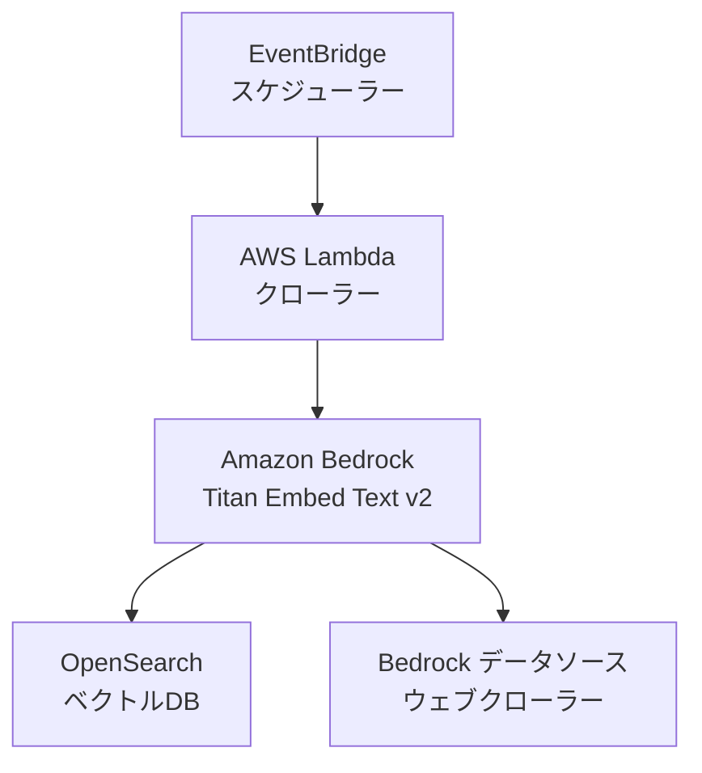

# Bedrock ウェブクローラー Terraform アーキテクチャ

## 概要

このプロジェクトは、Amazon BedrockとTerraformを使用してウェブクローラーアーキテクチャを実装します。BedrockのTitan Embed Text v2モデルを使用してウェブコンテンツを解析し、OpenSearchをベクトルデータベースとして使用します。クローリング対象のURLはTerraformの変数として指定します。

## アーキテクチャ



## コンポーネント

1. **Amazon Bedrock**:
   - Titan Embed Text v2モデルを使用
   - ウェブページからの情報抽出と解析
   - テキストのベクトル化と意味解析
   - クローリング対象URLの管理

2. **OpenSearch**:
   - ベクトルデータベースとして機能
   - 解析結果の効率的な検索と保存
   - コンテンツの類似性分析
   - ベクトルインデックスの最適化

3. **Lambda関数**:
   - Bedrockデータソースの設定
   - クローリング対象URLの管理
   - エラーハンドリング

4. **EventBridge**:
   - クローリングの定期実行（cron式で設定）
   - スケジュール管理

## Terraformリソース構造

```hcl
# IAMロール・ポリシー
resource "aws_iam_role" "crawler_lambda" {}
resource "aws_iam_policy" "bedrock_invoke_model" {}
resource "aws_iam_role" "bedrock_opensearch" {}
resource "aws_iam_role" "opensearch_index_role" {}

# OpenSearchドメイン
resource "aws_opensearch_domain" "vector_store" {}
resource "opensearch_index" "blog_index" {}

# Lambda関数
resource "aws_lambda_function" "crawler" {}
resource "aws_cloudwatch_event_rule" "crawler_schedule" {}

# Bedrock (CloudFormation)
resource "aws_cloudformation_stack" "bedrock" {}
```

## 前提条件

1. AWS CLIのインストールと設定
2. Terraformのインストール（バージョン1.0.0以上）
3. Amazon Bedrockサービスへのアクセス権限
4. OpenSearchサービスの利用権限

## デプロイ方法

1. このリポジトリをクローン
2. `014.bedrock-webcrawler`ディレクトリに移動
3. Terraformの初期化と適用：
   ```bash
   terraform init
   terraform plan
   terraform apply
   ```

## 変数の説明

1. **aws_region** (オプション):
   - 型: String
   - デフォルト: `ap-northeast-1`
   - 説明: AWSリージョン

2. **crawling_url** (オプション):
   - 型: String
   - デフォルト: `https://aws.amazon.com/jp/about-aws/whats-new/recent/feed/`
   - 説明: クロール対象のURL

3. **crawling_interval** (オプション):
   - 型: String
   - デフォルト: `cron(0 0 ? * MON *)`（毎週月曜日の午前0時に実行）
   - 説明: クローラー実行のスケジュール（cron式）

4. **opensearch_instance_type** (オプション):
   - 型: String
   - デフォルト: `t3.small.search`
   - 説明: OpenSearchのインスタンスタイプ

5. **project_name** (オプション):
   - 型: String
   - デフォルト: `bedrock-webcrawler`
   - 説明: プロジェクト名

6. **tags** (オプション):
   - 型: Map(String)
   - デフォルト: 環境、プロジェクト、管理ツールの情報
   - 説明: リソースに付与するタグ

7. **bedrock_model_arn** (オプション):
   - 型: String
   - デフォルト: Titan Embed Text v2のARN
   - 説明: Bedrockのモデル ARN

8. **crawler_scope** (オプション):
   - 型: String
   - デフォルト: `HOST_ONLY`
   - 説明: Bedrockウェブクローラーのスコープ

## セキュリティ考慮事項

1. **IAMロール**: 
   - Lambda関数に対する最小権限アクセス
   - Bedrockサービスに対する制限されたアクセス
   - OpenSearchに対する制限されたアクセス

2. **OpenSearchセキュリティ**: 
   - 暗号化とアクセス制御
   - IAMベースの認証

3. **ネットワークセキュリティ**: 
   - VPCエンドポイントとセキュリティグループ（必要に応じて設定）

## モニタリングとログ

1. **CloudWatchログ**: 
   - Lambda関数の実行ログ
   - クローリング状態の監視
   - エラー情報の確認

2. **OpenSearchダッシュボード**:
   - ベクトルデータの可視化
   - インデックスの状態監視
   - クエリパフォーマンスの分析

## コスト考慮事項

1. **Bedrock**: 
   - Titan Embed Text v2の使用料金
   - トークン数に応じた課金

2. **OpenSearch**: 
   - インスタンス料金
   - ストレージ料金
   - データ転送料金

3. **Lambda**: 
   - 実行時間に応じた料金
   - メモリ使用量による課金

## エラー処理

1. **クローリングエラー**:
   - 無効なURL
   - アクセス制限
   - タイムアウト

2. **Bedrockエラー**:
   - モデル呼び出しの失敗
   - トークン制限の超過
   - APIエラー

3. **システムエラー**:
   - Lambda関数のタイムアウト
   - メモリ不足
   - ネットワークエラー

エラーはCloudWatchログに記録され、必要に応じてアラートを設定できます。

## ローカルテスト

`scripts/014.bedrock-webcrawler/local_test.py`を使用して、ローカル環境からBedrockウェブクローラーをテストできます。詳細は`scripts/014.bedrock-webcrawler/README.md`を参照してください。

## 料金概算

1か月あたりの概算費用（東京リージョン）：

### OpenSearch Service
- t3.small.search × 1台: $30.24/月
- EBS gp3 10GB: $1.00/月
小計: $31.24/月

### Lambda
- メモリ: 256MB
- 実行時間: 5分 × 4回/月 = 20分
- 料金: Free Tier内（実質無料）
小計: $0/月

### Amazon Bedrock
- Titan Embed Text V2
  - 入力: $0.0001/1Kトークン
  - 週1回のクロール × 4週 = 月4回
  - 1回あたり約10,000トークン = 月40,000トークン
小計: $0.004/月

### VPCリソース（オプション）
- NAT Gateway: $32.40/月
  - 時間料金: $0.045/時 × 24時間 × 30日
  - データ処理: 約$1/月
- VPCエンドポイント: $7.20/月
  - $0.01/時 × 24時間 × 30日
小計: $40.60/月

### 合計推定費用
- USD: $71.844/月（税抜）
- JPY: ¥10,777/月（税抜）※1USD=150円で計算

※ この見積もりは以下の前提に基づきます：
- OpenSearchは24時間365日稼働
- Lambda関数は週1回実行
- データ転送量は最小限
- すべて東京リージョンでの料金