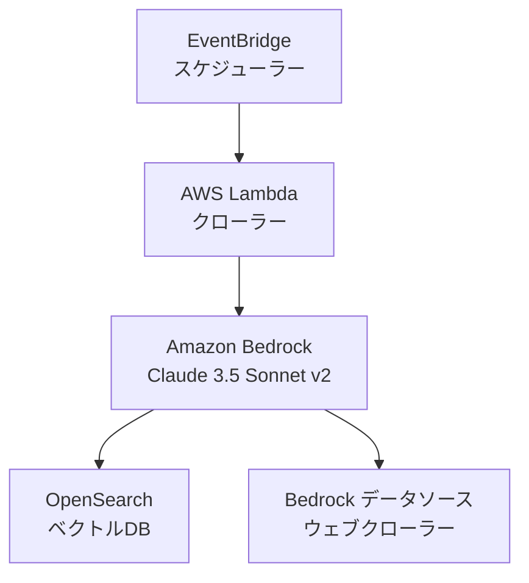

# Bedrock ウェブクローラー CloudFormation アーキテクチャ

## 概要

このプロジェクトは、Amazon BedrockとAWS CloudFormationを使用してウェブクローラーアーキテクチャを実装します。BedrockのClaude 3.5 Sonnet v2モデルを使用してウェブコンテンツを解析し、OpenSearchをベクトルデータベースとして使用します。クローリング対象のURLはCloudFormationのパラメータとして指定します。

## アーキテクチャ



## コンポーネント

1. **Amazon Bedrock**:
   - Claude 3.5 Sonnet v2モデルを使用
   - ウェブページからの情報抽出と解析
   - テキストのベクトル化と意味解析
   - クローリング対象URLの管理

2. **OpenSearch**:
   - ベクトルデータベースとして機能
   - 解析結果の効率的な検索と保存
   - コンテンツの類似性分析
   - ベクトルインデックスの最適化

3. **Lambda関数**:
   - Bedrockデータソースの設定
   - クローリング対象URLの管理
   - エラーハンドリング

4. **EventBridge**:
   - クローリングの定期実行
   - スケジュール管理

## CloudFormationテンプレート構造

```yaml
Parameters:
  CrawlingUrls:
    Type: CommaDelimitedList
    Description: クロール対象のURLリスト（カンマ区切り）

Resources:
  # IAMロール
  CrawlerLambdaRole:
    Type: AWS::IAM::Role
    # Lambda用のBedrock、OpenSearchアクセス権限

  # OpenSearchドメイン
  VectorStore:
    Type: AWS::OpenSearchService::Domain
    # ベクトルエンジン設定

  # Lambda関数
  CrawlerFunction:
    Type: AWS::Lambda::Function
    # ウェブクローラーの実装

  # EventBridge
  CrawlerSchedule:
    Type: AWS::Events::Rule
    # スケジューリング設定
```

## 前提条件

1. AWS CLIのインストールと設定
2. Amazon Bedrockサービスへのアクセス権限
3. CloudFormationデプロイ用の適切なIAM権限
4. OpenSearchサービスの利用権限

## デプロイ方法

1. このリポジトリをクローン
2. `014.bedrock-webcrawler`ディレクトリに移動
3. CloudFormationスタックのデプロイ：
   ```bash
   aws cloudformation create-stack \
     --stack-name bedrock-webcrawler \
     --template-body file://template.yaml \
     --parameters \
       ParameterKey=CrawlingUrls,ParameterValue=\"https://example.com,https://example.org\" \
     --capabilities CAPABILITY_IAM
   ```

## パラメータの説明

1. **CrawlingUrls** (必須):
   - 型: CommaDelimitedList
   - 説明: クロール対象のURLリスト（カンマ区切り）
   - 例: `"https://example.com,https://example.org"`

2. **CrawlingInterval** (オプション):
   - 型: String
   - デフォルト: `rate(1 hour)`
   - 説明: クローリングの実行間隔
   - 例: `rate(30 minutes)`, `rate(2 hours)`

3. **OpenSearchInstanceType** (オプション):
   - 型: String
   - デフォルト: `r6g.large.search`
   - 説明: OpenSearchのインスタンスタイプ

4. **BedrockMaxTokens** (オプション):
   - 型: Number
   - デフォルト: 4096
   - 説明: Bedrockモデルの最大トークン数

## セキュリティ考慮事項

1. **IAMロール**: Lambda関数に対する最小権限アクセス
2. **OpenSearchセキュリティ**: 暗号化とアクセス制御
3. **ネットワークセキュリティ**: VPCエンドポイントとセキュリティグループ

## モニタリングとログ

1. **CloudWatchログ**: 
   - Lambda関数の実行ログ
   - クローリング状態の監視
   - エラー情報の確認

2. **OpenSearchダッシュボード**:
   - ベクトルデータの可視化
   - インデックスの状態監視
   - クエリパフォーマンスの分析

## コスト考慮事項

1. **Bedrock**: 
   - Claude 3.5 Sonnet v2の使用料金
   - トークン数に応じた課金

2. **OpenSearch**: 
   - インスタンス料金
   - ストレージ料金
   - データ転送料金

3. **Lambda**: 
   - 実行時間に応じた料金
   - メモリ使用量による課金

## エラー処理

1. **クローリングエラー**:
   - 無効なURL
   - アクセス制限
   - タイムアウト

2. **Bedrockエラー**:
   - モデル呼び出しの失敗
   - トークン制限の超過
   - APIエラー

3. **システムエラー**:
   - Lambda関数のタイムアウト
   - メモリ不足
   - ネットワークエラー

エラーはCloudWatchログに記録され、必要に応じてアラートを設定できます。
