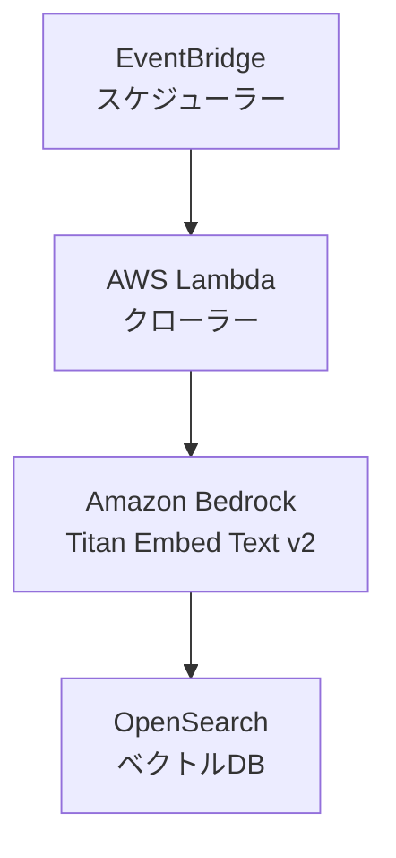

# Bedrock ナレッジベース Terraform アーキテクチャ

## 概要

このプロジェクトは、Amazon BedrockとTerraformを使用してナレッジベースアーキテクチャを実装します。BedrockのTitan Embed Text v2モデルを使用してコンテンツを解析し、OpenSearchをベクトルデータベースとして使用します。

## アーキテクチャ



## コンポーネント

1. **Amazon Bedrock**:
   - Titan Embed Text v2モデルを使用
   - テキストのベクトル化と意味解析
   - ナレッジベースの管理

2. **OpenSearch**:
   - ベクトルデータベースとして機能
   - 解析結果の効率的な検索と保存
   - コンテンツの類似性分析
   - ベクトルインデックスの最適化

3. **Lambda関数**:
   - Bedrockナレッジベースの操作
   - エラーハンドリング

4. **EventBridge**:
   - Lambda関数の定期実行（cron式で設定）
   - スケジュール管理

## Terraformリソース構造

```hcl
# IAMロール・ポリシー
resource "aws_iam_role" "crawler_lambda" {}
resource "aws_iam_policy" "bedrock_invoke_model" {}
resource "aws_iam_role" "bedrock_opensearch" {}
resource "aws_iam_policy" "bedrock_opensearch_access" {}
resource "aws_iam_role" "cloudformation" {}
resource "aws_iam_policy" "cloudformation_admin" {}

# OpenSearchドメイン
resource "aws_opensearch_domain" "vector_store" {}
resource "opensearch_index" "blog_index" {}

# Lambda関数
resource "aws_lambda_function" "crawler" {}
resource "aws_cloudwatch_event_rule" "crawler_schedule" {}

# Bedrock (CloudFormation経由)
resource "aws_cloudformation_stack" "bedrock" {}
```

## 前提条件

1. AWS CLIのインストールと設定
2. Amazon Bedrockサービスへのアクセス権限
3. Terraformのインストール（バージョン1.0.0以上）
4. OpenSearchサービスの利用権限

## デプロイ方法

1. このリポジトリをクローン
2. `014.bedrock-webcrawler`ディレクトリに移動
3. Terraformの初期化と適用：
   ```bash
   terraform init
   terraform plan
   terraform apply
   ```

## 変数の説明

1. **aws_region** (オプション):
   - 説明: AWSリージョン
   - デフォルト: `ap-northeast-1`

2. **crawling_interval** (オプション):
   - 説明: Lambda関数実行のスケジュール (cron形式)
   - デフォルト: `cron(0 0 ? * SUN *)` (毎週日曜日の午前0時に実行)

3. **opensearch_instance_type** (オプション):
   - 説明: OpenSearchのインスタンスタイプ
   - デフォルト: `t3.small.search`

4. **project_name** (オプション):
   - 説明: プロジェクト名
   - デフォルト: `bedrock-webcrawler`

5. **default_tags** (オプション):
   - 説明: デフォルトのリソースタグ
   - デフォルト: Environment=Production, Project=BedrockWebCrawler, ManagedBy=Terraform

6. **bedrock_model_arn** (オプション):
   - 説明: BedrockのEmbeddingモデルARN
   - デフォルト: `amazon.titan-embed-text-v2:0`

## ローカルテスト

`scripts/local_test.py`を使用して、ローカル環境からBedrockナレッジベースをテストできます：

```bash
# ナレッジベースIDを指定してテストを実行
python local_test.py --knowledge-base-id kb-12345abcdef
```

## セキュリティ考慮事項

1. **IAMロール**: 
   - Lambda関数に対する最小権限アクセス
   - Bedrockサービスに必要な最小限の権限
   - OpenSearchへのアクセスは適切なIAMロールを通じて制御
   - CloudFormationに必要な権限

2. **OpenSearchセキュリティ**: 
   - 暗号化とアクセス制御
   - マスターユーザーとしてIAMロールを使用

## モニタリングとログ

1. **CloudWatchログ**: 
   - Lambda関数の実行ログ
   - エラー情報の確認

2. **OpenSearchダッシュボード**:
   - ベクトルデータの可視化
   - インデックスの状態監視
   - クエリパフォーマンスの分析

## コスト考慮事項

1. **Bedrock**: 
   - Titan Embed Text v2の使用料金
   - トークン数に応じた課金

2. **OpenSearch**: 
   - インスタンス料金
   - ストレージ料金
   - データ転送料金

3. **Lambda**: 
   - 実行時間に応じた料金
   - メモリ使用量による課金

## エラー処理

1. **Lambda関数のエラー**:
   - タイムアウト
   - メモリ不足
   - ネットワークエラー

2. **Bedrockエラー**:
   - モデル呼び出しの失敗
   - トークン制限の超過
   - APIエラー

エラーはCloudWatchログに記録され、必要に応じてアラートを設定できます。

## 料金概算

1か月あたりの概算費用（東京リージョン）：

### OpenSearch Service
- t3.small.search × 1台: $30.24/月
- EBS gp3 10GB: $1.00/月
小計: $31.24/月

### Lambda
- メモリ: 256MB
- 実行時間: 5分 × 4回/月 = 20分
- 料金: Free Tier内（実質無料）
小計: $0/月

### Amazon Bedrock
- Titan Embed Text V2
  - 入力: $0.0001/1Kトークン
  - 週1回のクロール × 4週 = 月4回
  - 1回あたり約10,000トークン = 月40,000トークン
小計: $0.004/月

### 合計推定費用
- USD: $31.244/月（税抜）
- JPY: ¥4,687/月（税抜）※1USD=150円で計算

※ この見積もりは以下の前提に基づきます：
- OpenSearchは24時間365日稼働
- Lambda関数は週1回実行
- データ転送量は最小限
- すべて東京リージョンでの料金