# Amazon EKS (Elastic Kubernetes Service) 構成

このTerraform構成は、AWSにEKSクラスターとワーカーノード、管理用のkubectlインスタンスを作成します。



## リソース構成

### ネットワークリソース
- **VPC**: CIDRブロック10.0.0.0/16
- **パブリックサブネット1**: ワーカーノード用（10.0.0.0/24）
- **パブリックサブネット2**: ワーカーノード用（10.0.1.0/24）
- **kubectlインスタンス用サブネット**: 管理インスタンス用（10.0.10.0/24）
- **インターネットゲートウェイ**: インターネット接続用
- **ルートテーブル**: インターネットゲートウェイへのルート（0.0.0.0/0）
- **セキュリティグループ**: EKSクラスター用（HTTPS 443ポート許可）

### EKSリソース
- **EKSクラスター**：
  - クラスター名: eks-study
  - Kubernetesバージョン: 1.27
  - プライベートエンドポイントアクセス: 有効
  - パブリックエンドポイントアクセス: 無効
  - 複数のアベイラビリティゾーンに配置

- **EKSノードグループ**：
  - インスタンスタイプ: t2.micro
  - 最小サイズ: 0
  - 最大サイズ: 1
  - 希望サイズ: 0（デフォルト）
  - 最新のEKS最適化AMIを自動取得

### 管理リソース
- **kubectlインスタンス**：
  - インスタンスタイプ: t2.micro
  - EKSクラスター管理用
  - kubectlツールの自動インストール
  - 専用IAMインスタンスプロファイル

### IAMリソース
- **EKSマスターロール**: EKSクラスター用のサービスロール
- **EKSノードロール**: ワーカーノード用のサービスロール
  - AmazonEKSWorkerNodePolicy
  - AmazonEKS_CNI_Policy
  - AmazonEC2ContainerRegistryReadOnly

## セキュリティ設計

- EKSクラスターはプライベートエンドポイントのみでアクセス可能
- ワーカーノードは複数のアベイラビリティゾーンに分散配置
- IAMロールベースのアクセス制御
- セキュリティグループによるネットワークレベルの制御

## 主要な設定可能パラメータ

| パラメータ | デフォルト値 | 説明 |
|-----------|-------------|------|
| cluster_name | eks-study | EKSクラスター名 |
| cluster_version | 1.27 | Kubernetesバージョン |
| node_instance_types | ["t2.micro"] | ワーカーノードのインスタンスタイプ |
| node_desired_size | 0 | ワーカーノードの希望数 |
| node_max_size | 1 | ワーカーノードの最大数 |
| node_min_size | 0 | ワーカーノードの最小数 |
| vpc_cidr_block | 10.0.0.0/16 | VPCのCIDRブロック |
| num_subnets | 2 | サブネット数 |

## 使用方法

この構成をデプロイするには、メインのREADME.mdに記載されている手順に従ってください。

### 前提条件
- AWS CLIの設定が完了していること
- 適切なIAM権限を持つAWSアカウント
- Terraformがインストールされていること

### デプロイ後の確認
```bash
# EKSクラスターの状態確認
aws eks describe-cluster --name eks-study

# ノードグループの状態確認
aws eks describe-nodegroup --cluster-name eks-study --nodegroup-name node_group

# kubeconfigの設定
aws eks update-kubeconfig --name eks-study
```

## 注意事項

- ワーカーノードの希望サイズはデフォルトで0に設定されています
- 実際にPodを実行する場合は、ノード数を適切に調整してください
- EKSクラスターの削除には時間がかかる場合があります
- kubectlインスタンスのSSHキーペアを事前に作成する必要があります