# TFLint AWS プラグイン用の読み取り専用ロール設定

このプロジェクトは、GitHub ActionsからAWS IAMロールをAssumeするための設定を提供します。
主にTFLintのAWSプラグインのdeep_check機能を使用するために、読み取り専用権限を持つIAMロールを作成します。

## アーキテクチャ図



## 概要

以下のリソースが作成されます：
- **GitHub OIDC Provider**: GitHub ActionsからのOIDC認証を可能にするプロバイダー
- **IAM Role**: TFLint用の読み取り専用ロール（ViewOnlyAccessポリシー付き）
- **CloudFormation Stack**: 上記リソースを管理するスタック

### リソース構成詳細

1. **AWS::IAM::OIDCProvider**
   - GitHub Actions用のOIDCプロバイダー
   - URL: https://token.actions.githubusercontent.com
   - 指定されたGitHubリポジトリからのみアクセス可能

2. **AWS::IAM::Role**
   - ロール名: `{StackName}-tflint-readonly-role`
   - 管理ポリシー: `ViewOnlyAccess`
   - 信頼関係: 指定されたGitHubリポジトリのみ

## デプロイ方法

このプロジェクトのTerraformファイルを使用して、CloudFormationスタックをデプロイします。

```bash
cd 020.aws-readonly-oidc
terraform init
terraform plan
terraform apply
```

## GitHub Actionsでの利用方法

デプロイ後、以下の手順でGitHub Actionsワークフローでロールを使用できます：

1. GitHub リポジトリの Settings > Secrets and variables > Actions に移動
2. 新しいシークレット `AWS_ROLE_ARN` を作成し、デプロイ後に出力されたロールARNを設定

これにより、`.github/workflows/terraform-linter-pr.yml` ワークフローが自動的にこのロールを使用して
TFLintのAWSプラグインのdeep_check機能を有効化します。

## 注意事項

- このロールはViewOnlyAccessポリシーのみを持ち、読み取り専用の権限しか持ちません
- GitHub ActionsのOIDC認証を使用しているため、長期的なアクセスキーは不要です
- 特定のGitHubリポジトリからのみアクセス可能なため、セキュリティリスクが低減されています