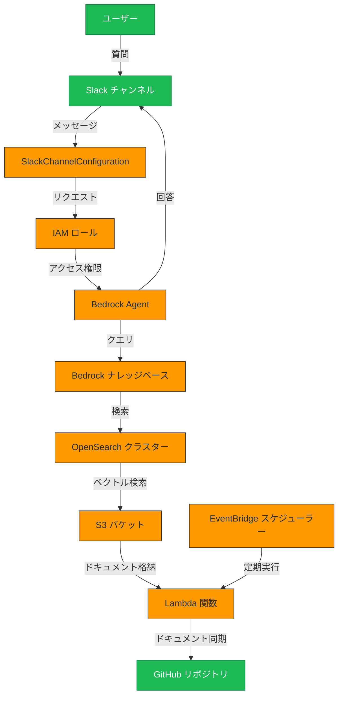

# Bedrock Agent を使用した Slack チャットアプリケーション


## 概要

このプロジェクトは、Amazon Bedrock Agent を使用して Slack からチャットで応答できるシステムを構築するための CloudFormation スタックを提供します。ユーザーは Slack チャンネル内で質問を投げかけると、Bedrock Agent が回答を生成し、その場で返信します。

## アーキテクチャ



このシステムは以下のコンポーネントで構成されています：

1. **Slack チャンネル設定**
   - Amazon Q Developer in Chat Applications の SlackChannelConfiguration を使用
   - Slack ワークスペースと特定のチャンネルを AWS サービスと連携

2. **IAM ロールとポリシー**
   - Slack チャンネル設定に紐づく IAM ロール
   - Bedrock Agent へのアクセス権限を持つポリシー

3. **Amazon Bedrock コンポーネント**
   - Bedrock Agent: ユーザーからの質問に応答するエージェント
   - Bedrock ナレッジベース: 情報源となるドキュメントを管理
   - Bedrock Agent Alias: エージェントのバージョン管理

4. **OpenSearch マネージドクラスター**
   - ベクトルデータベースとして機能
   - ドキュメントの埋め込みベクトルを保存し、類似検索を実行

5. **S3 バケット**
   - ナレッジベースのソースとなるドキュメントを保存
   - GitHub リポジトリから同期されたドキュメントを格納

6. **Lambda 関数**
   - 指定した GitHub リポジトリから S3 バケットにドキュメントを同期
   - GitHub Personal Access Token (PAT) を使用してリポジトリにアクセス

7. **EventBridge スケジューラー**
   - Lambda 関数を定期的に実行し、ドキュメントを最新の状態に保つ

## デプロイ方法

### 前提条件

- AWS CLI がインストールされ、適切に設定されていること
- Slack ワークスペースの管理者権限
- GitHub リポジトリへのアクセス権と Personal Access Token
- Terraform 1.0.0 以上がインストールされていること

### デプロイ手順

#### Lambda 関数のソースコードの準備

1. Lambda 関数のソースコードディレクトリを作成します
   ```bash
   mkdir -p lambda_source/github_to_s3_sync
   cp scripts/023.bedrock-rag-agent-in-slack/github_to_s3_sync.py lambda_source/github_to_s3_sync/
   cp scripts/023.bedrock-rag-agent-in-slack/requirements.txt lambda_source/github_to_s3_sync/
   ```

#### Terraform を使用したデプロイ

1. terraform.tfvars ファイルを作成し、必要なパラメータを設定します
   ```
   # terraform.tfvars の例
   aws_region          = "us-east-1"
   project_name        = "bedrock-slack-chat"
   slack_workspace_id  = "YOUR_WORKSPACE_ID"
   slack_channel_id    = "YOUR_CHANNEL_ID"
   slack_channel_name  = "YOUR_CHANNEL_NAME"
   github_repository_url = "https://github.com/yourusername/yourrepo"
   github_pat          = "YOUR_GITHUB_PAT"
   ```

2. Terraform を初期化し、デプロイを実行します
   ```bash
   terraform init
   terraform plan
   terraform apply
   ```

3. デプロイが完了すると、自動的に Lambda 関数が実行され、GitHub リポジトリから S3 バケットにドキュメントが同期されます。

#### CloudFormation を使用したデプロイ（従来の方法）

1. パラメータの準備
   ```
   # 必要なパラメータ
   - SlackWorkspaceId: Slack ワークスペースの ID
   - SlackChannelId: Slack チャンネルの ID
   - SlackChannelName: Slack チャンネルの名前
   - BedrockModelId: 使用する Bedrock モデルの ID
   - GitHubRepositoryUrl: ナレッジベースのソースとなる GitHub リポジトリの URL
   - GitHubPAT: GitHub Personal Access Token
   ```

2. CloudFormation スタックのデプロイ
   ```bash
   aws cloudformation deploy \
     --template-file template.yaml \
     --stack-name bedrock-slack-chat \
     --parameter-overrides \
       SlackWorkspaceId=YOUR_WORKSPACE_ID \
       SlackChannelId=YOUR_CHANNEL_ID \
       SlackChannelName=YOUR_CHANNEL_NAME \
       BedrockModelId=YOUR_MODEL_ID \
       GitHubRepositoryUrl=YOUR_REPO_URL \
       GitHubPAT=YOUR_PAT \
     --capabilities CAPABILITY_NAMED_IAM
   ```

3. Bedrock スタックのデプロイ
   ```bash
   aws cloudformation deploy \
     --template-file bedrock-template.yaml \
     --stack-name bedrock-agent-stack \
     --parameter-overrides \
       MainStackName=bedrock-slack-chat \
     --capabilities CAPABILITY_IAM
   ```

4. Lambda スタックのデプロイ
   ```bash
   aws cloudformation deploy \
     --template-file lambda-template.yaml \
     --stack-name bedrock-lambda-stack \
     --parameter-overrides \
       MainStackName=bedrock-slack-chat \
     --capabilities CAPABILITY_IAM
   ```

5. Lambda 関数を手動で実行して、GitHub リポジトリから S3 バケットにドキュメントを同期します
   ```bash
   aws lambda invoke \
     --function-name bedrock-slack-chat-github-to-s3-sync \
     --payload '{}' \
     /tmp/lambda_output.json
   ```

## 使用方法

1. Slack チャンネルで AWS Chatbot を招待します
2. チャンネル内で質問を投げかけると、Bedrock Agent が回答を生成します
3. ナレッジベースの更新は、設定した EventBridge スケジュールに従って自動的に行われます

## Slackからナレッジベースへの接続

```
@Amazon Q
connector add agent {Bedrock Agent ARN} {Bedrock AgentのエイリアスID}
```

## トラブルシューティング

- Slack 連携に問題がある場合は、AWS Chatbot の設定を確認してください
- Bedrock Agent の応答に問題がある場合は、CloudWatch Logs でエラーを確認してください
- ナレッジベースの更新に問題がある場合は、Lambda 関数のログを確認してください

## セキュリティ考慮事項

- GitHub PAT は AWS Systems Manager Parameter Store に安全に保存されます
- OpenSearch クラスターは暗号化されています
- IAM ロールは最小権限の原則に従って設定されています