# AWS EC2 Ansible Playbook

このプロジェクトは、AnsibleでAWS VPCとEC2インスタンスを作成・削除するためのPlaybookです。



## 構成

### ディレクトリ構造
```
ansible/
├── ansible.cfg
├── aws.yml                 # メインPlaybook（VPC + EC2作成）
├── delete_aws.yml         # 削除用Playbook
├── site.yml               # 全体のPlaybook
├── ping.yml               # 接続テスト用
├── inventories/
│   └── staging/
│       ├── hosts          # インベントリファイル
│       └── group_vars/
│           ├── local.yml  # 作成用変数
│           └── delete.yml # 削除用変数
└── roles/
    ├── vpc/               # VPC作成ロール
    │   └── tasks/
    │       └── main.yml
    └── ec2/               # EC2作成ロール
        └── tasks/
            ├── main.yml   # メインタスク
            └── delete.yml # 削除タスク
```

### 作成されるリソース

#### VPCリソース
- VPC (10.0.0.0/16)
- パブリックサブネット × 2
  - subnet-public-1 (10.0.1.0/24, ap-northeast-1a)
  - subnet-public-2 (10.0.2.0/24, ap-northeast-1c)

#### EC2リソース
- Internet Gateway
- Route Table (パブリック用)
- Security Group (SSH, HTTP, HTTPS許可)
- EC2インスタンス (t3.micro, Amazon Linux 2)

## コスト最適化の特徴

1. **インスタンスタイプ**: t3.micro（無料利用枠対象）
2. **ストレージ**: GP3 8GB（コスト効率の良いストレージタイプ）
3. **AMI**: Amazon Linux 2（無料）
4. **ネットワーク**: パブリックサブネットのみ（NATゲートウェイ不要）
5. **最小限のセキュリティグループルール**

## 使用方法

### 前提条件

1. AWS CLIの設定
2. Ansibleのインストール
3. amazon.aws コレクションのインストール
4. EC2キーペアの作成

```bash
# Ansibleコレクションのインストール
ansible-galaxy collection install amazon.aws

# EC2キーペアの作成（AWSコンソールまたはCLI）
aws ec2 create-key-pair --key-name my-key-pair --query 'KeyMaterial' --output text > my-key-pair.pem
chmod 400 my-key-pair.pem
```

### 設定変更

`inventories/staging/group_vars/local.yml`でキーペア名を変更してください：

```yaml
aws:
  ec2:
    key_name: "your-key-pair-name"  # 実際のキーペア名に変更
```

### リソース作成

```bash
cd ansible
ansible-playbook -i inventories/staging/hosts aws.yml
```

### リソース削除

```bash
cd ansible
ansible-playbook -i inventories/staging/hosts delete_aws.yml
```

### 全体実行（ping + 作成）

```bash
cd ansible
ansible-playbook -i inventories/staging/hosts site.yml
```

## 設定のカスタマイズ

### インスタンスタイプの変更

`inventories/staging/group_vars/local.yml`：

```yaml
aws:
  ec2:
    instance_type: "t3.small"  # 必要に応じて変更
```

### 複数インスタンスの作成

```yaml
aws:
  ec2:
    instances:
      - name: "web-server-1"
        tags:
          Name: "WebServer1"
          Environment: "staging"
      - name: "web-server-2"
        tags:
          Name: "WebServer2"
          Environment: "staging"
```

### セキュリティグループルールの追加

EC2ロールの`tasks/main.yml`でルールを追加：

```yaml
rules:
  - proto: tcp
    ports:
      - 8080
    cidr_ip: 0.0.0.0/0
    rule_desc: Custom application port
```

## トラブルシューティング

### よくあるエラー

1. **キーペアが見つからない**
   - AWSコンソールでキーペアを作成
   - `local.yml`でキーペア名を正しく設定

2. **権限エラー**
   - AWS CLIの認証情報を確認
   - 必要なIAMポリシーが付与されているか確認

3. **リソース削除エラー**
   - 依存関係のあるリソースから順番に削除
   - 手動でリソースを確認・削除

### ログの確認

```bash
# 詳細ログで実行
ansible-playbook -i inventories/staging/hosts aws.yml -v

# デバッグモードで実行
ansible-playbook -i inventories/staging/hosts aws.yml -vvv
```

## セキュリティ注意事項

- セキュリティグループは必要最小限のポートのみ開放
- SSH接続は信頼できるIPアドレスからのみ許可することを推奨
- 本番環境では適切なIAMロールとポリシーを設定
- キーペアファイルは適切に管理・保護

## ライセンス

このプロジェクトはMITライセンスの下で公開されています。