# Aurora Mock Testing Project

このプロジェクトは、Aurora PostgreSQL、Secrets Manager、ECS、Lambdaを使用したシステムのモックテストを実装します。



## 構成

### CloudFormation リソース
- Aurora Serverless (PostgreSQL)
- Secrets Manager (Auroraエンドポイント情報)
- ECS (Flask REST API)
- Lambda (Python - データアクセス層)

### Terraform リソース
- IAMトークン認証用PostgreSQLユーザ

### テスト
- Lambda Python コードの単体テスト
- moto を使用したboto3.clientのモック
- unittest.mock を使用したpsycopg2のモック
- pytest monkeypatch を使用した環境変数のモック

## ディレクトリ構成

```
035.aurora-mock-testing/
├── README.md                 # このファイル
├── main.tf                   # Terraform メイン設定
├── variables.tf              # Terraform 変数定義
├── outputs.tf                # Terraform 出力定義
├── provider.tf               # Terraform プロバイダー設定
├── requirements.txt          # 開発用依存関係
├── requirements-layer.txt    # Lambda レイヤー用依存関係
├── cfn/                      # CloudFormation テンプレート
│   ├── aurora.yaml
│   ├── secrets-manager.yaml
│   ├── ecs.yaml
│   └── lambda.yaml
├── scripts/                  # スクリプトファイル
│   ├── deploy.sh
│   ├── lambda_function.py
│   ├── lambda_function_original.py
│   ├── custom_utils.py       # Lambda レイヤー用カスタムスクリプト
│   ├── build_layer.ps1       # レイヤービルドスクリプト
│   └── test_layer.ps1        # レイヤーテストスクリプト
└── tests/                    # 単体テストファイル
    ├── test_lambda_function.py
    └── conftest.py
```

## 技術仕様

- リージョン: ap-northeast-1
- Python 3.9+
- boto3
- psycopg2
- Flask
- pytest
- moto

## デプロイ手順

1. Terraform でIAMトークン認証を設定
2. CloudFormation でAWSリソースをデプロイ
3. テストスクリプトを実行

## テスト実行

### 単体テスト

```bash
cd tests/
pytest test_lambda_function.py -v
```

### Lambda レイヤーテスト

カスタムスクリプトをLambdaレイヤーに含めて動作確認するテストです。

#### レイヤーのビルド

```powershell
# カスタムスクリプトのみ（依存関係なし）
.\scripts\build_layer.ps1

# 依存関係を含める場合
.\scripts\build_layer.ps1 -IncludeDependencies
```

#### Lambda関数の作成とテスト

```powershell
# カスタムスクリプトのみでテスト
.\scripts\test_layer.ps1

# 依存関係を含めてテスト
.\scripts\test_layer.ps1 -IncludeDependencies
```

このスクリプトは以下を実行します：
1. Lambda レイヤーをビルド（custom_utils.pyを含む）
2. Lambda 関数パッケージを作成
3. IAMロールを作成
4. レイヤーをAWSに公開
5. Lambda関数を作成（レイヤーをアタッチ）
6. 関数を実行してimportを確認

#### カスタムスクリプト（custom_utils.py）

レイヤーに含まれるユーティリティ関数：
- `format_response(status, data)`: APIレスポンスのフォーマット
- `validate_config(config)`: 設定の検証

#### リソースの削除

```powershell
aws lambda delete-function --function-name test-layer-import --region ap-northeast-1
aws lambda delete-layer-version --layer-name test-layer-import-layer --version-number <VERSION> --region ap-northeast-1
aws iam delete-role --role-name test-layer-import-role
```