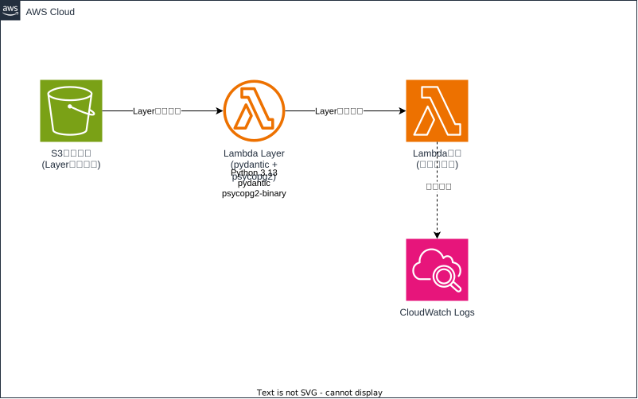

# Lambda Layer 実行手順

## アーキテクチャ図



## 📋 必要な準備
1. Docker Desktop を起動
2. AWS CLI プロファイル `default` が設定済み
3. PowerShell実行ポリシーが適切に設定済み

## 🚀 ワンコマンド実行
```powershell
.\deploy-complete.ps1
```

## 📝 実行内容
このスクリプトは以下を自動実行します：

1. **Dockerでレイヤー作成** - Linux互換バイナリを生成
2. **S3アップロード** - レイヤーファイルをS3に保存
3. **CloudFormation** - AWS リソースをデプロイ
4. **レイヤー発行** - 新しいバージョンを作成
5. **Lambda更新** - 関数に最新レイヤーを適用
6. **動作テスト** - pydantic/psycopg2の機能確認

## 📊 成功時の出力例
```
=== Test Results ===
Overall Status: PASS
Python Version: 3.13.9 (main, Dec  4 2025, 17:56:55)

Library Versions:
  pydantic: 2.12.4
  psycopg2: 2.9.11 (dt dec pq3 ext lo64)

Test Results:
  pydantic: PASS
  psycopg2: PASS
  integration: PASS

🎉 All tests passed! Lambda Layer deployment successful!
```

## ⚙️ カスタマイズ実行
```powershell
# 異なるプロファイルやスタック名を使用
.\deploy-complete.ps1 -Profile "my-profile" -StackName "my-stack" -BucketName "my-bucket"
```

## 📁 現在の構成
- `requirements.txt` - 固定ライブラリバージョン
- `create_layer_docker.ps1` - レイヤー作成スクリプト  
- `cloudformation-template.yaml` - AWSリソース定義
- `lambda_function.py` - テスト用Lambda関数
- `deploy-complete.ps1` - **完全自動化スクリプト** ⭐