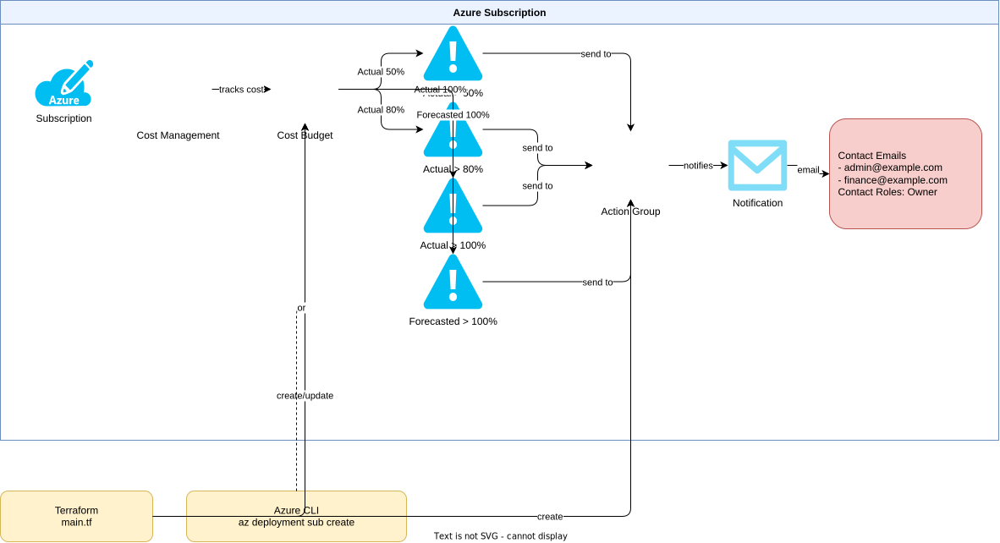

# Azure 課金アラート

このコードは、Azure Cost Management の予算アラート（Budget Alert）を設定します。実際の支出（Actual）および予測支出（Forecasted）が設定した閾値を超えた際に、指定したメールアドレスへ通知を送信します。



## 概要

このモジュールは以下のリソースを作成します：

- **予算 (Budget)**: サブスクリプションスコープでの月次・四半期・年次予算設定
- **実績コストアラート (Actual Alert)**: 実際の支出が閾値を超えた際の通知（3段階）
- **予測コストアラート (Forecasted Alert)**: 予測支出が閾値を超える見込みになった際の事前通知
- **Action Group**: アラート通知先のメールアドレスとロール設定

## 技術仕様

- **Terraformバージョン**: >= 1.9.6
- **Azure RM プロバイダーバージョン**: ~> 4.0
- **デプロイスコープ**: サブスクリプション（`az deployment sub create`）
- **ARMテンプレートAPI**: `Microsoft.Consumption/budgets` (2019-10-01)

## ファイル構成

```
042.azure-billing-alert/
├── README.md                    # このファイル
├── terraform.tf                 # Terraformプロバイダー設定
├── variables.tf                 # 変数定義
├── main.tf                      # Action GroupおよびBudgetリソース定義
├── outputs.tf                   # 出力値の定義
├── terraform.tfvars.example     # 設定例ファイル
├── arm/
│   └── budget.json              # ARMテンプレート (Microsoft.Consumption/budgets)
└── scripts/
    └── deploy.sh                # ARMテンプレートデプロイスクリプト
```

## 使用方法

### 方法 A: Terraform によるデプロイ（推奨）

#### 1. 前提条件

- Azure CLI がインストール済みであること
- `az login` で認証済みであること
- 適切な Azure サービスプリンシパルまたはユーザー権限があること

必要な権限：
- `Microsoft.Consumption/budgets/write`（予算の作成・更新）
- `microsoft.insights/actionGroups/write`（Action Group の作成）
- `Microsoft.Resources/resourceGroups/write`（リソースグループの作成）

#### 2. 設定ファイルの準備

```bash
cd 042.azure-billing-alert

# 設定ファイルのコピー
cp terraform.tfvars.example terraform.tfvars

# 必要な値を編集
# subscription_id, start_date, end_date, alert_email_addresses は必須
```

#### 3. デプロイ

```bash
# 初期化
terraform init

# プランの確認
terraform plan

# 適用
terraform apply

# 削除
terraform destroy
```

### 方法 B: ARMテンプレートによるデプロイ

#### 1. 前提条件

- Azure CLI がインストール済みであること
- `az login` で認証済みであること

#### 2. deploy.sh を使用したデプロイ

```bash
cd 042.azure-billing-alert

# 実行権限の付与（初回のみ）
chmod +x scripts/deploy.sh

# デプロイ（必須パラメータを指定）
./scripts/deploy.sh \
  --subscription-id "xxxxxxxx-xxxx-xxxx-xxxx-xxxxxxxxxxxx" \
  --start-date "2025-01-01" \
  --end-date "2025-12-31" \
  --contact-emails '["admin@example.com","finance@example.com"]'
```

#### 3. Azure CLI を直接使用したデプロイ

```bash
az deployment sub create \
  --name "billing-alert-deployment" \
  --location "japaneast" \
  --template-file arm/budget.json \
  --parameters \
    budgetName="Monthly-Billing-Alert" \
    amount=100 \
    timeGrain="Monthly" \
    startDate="2025-01-01" \
    endDate="2025-12-31" \
    contactEmails='["admin@example.com"]' \
    contactRoles='["Owner"]'
```

#### 4. 削除

```bash
# deploy.sh を使用した削除
./scripts/deploy.sh \
  --subscription-id "xxxxxxxx-xxxx-xxxx-xxxx-xxxxxxxxxxxx" \
  --destroy
```

## 設定パラメータ

### Terraform 変数

#### 必須パラメータ

| パラメータ名 | 説明 | 例 |
|-------------|------|-----|
| `subscription_id` | Azure サブスクリプション ID | `"xxxxxxxx-xxxx-xxxx-xxxx-xxxxxxxxxxxx"` |
| `start_date` | 予算開始日（月の初日） | `"2025-01-01"` |
| `end_date` | 予算終了日 | `"2025-12-31"` |
| `alert_email_addresses` | アラート通知先メールアドレス | `["admin@example.com"]` |

#### オプションパラメータ

| パラメータ名 | デフォルト値 | 説明 |
|-------------|-------------|------|
| `resource_group_name` | `rg-billing-alert` | Action Group 用リソースグループ名 |
| `location` | `japaneast` | Azure リージョン |
| `budget_name` | `Monthly-Billing-Alert` | 予算の表示名 |
| `budget_amount` | `100` | 予算金額 |
| `time_grain` | `Monthly` | 予算期間単位 (Monthly/Quarterly/Annual) |
| `actual_alert_thresholds` | `[50, 80, 100]` | 実績コストアラート閾値（%） |
| `forecasted_alert_threshold` | `100` | 予測コストアラート閾値（%） |
| `action_group_name` | `ag-billing-alert` | Action Group 名 |
| `action_group_short_name` | `BillingAlert` | Action Group 短縮名（最大 12 文字） |
| `tags` | `{Terraform="true", ...}` | リソースに付与するタグ |

### ARMテンプレートパラメータ

| パラメータ名 | デフォルト値 | 説明 |
|-------------|-------------|------|
| `budgetName` | `Monthly-Billing-Alert` | 予算名 |
| `amount` | `100` | 予算金額 |
| `timeGrain` | `Monthly` | 予算期間単位 (Monthly/Quarterly/Annual) |
| `startDate` | - | 予算開始日（必須） |
| `endDate` | - | 予算終了日（必須） |
| `contactEmails` | - | 通知先メールアドレスの配列（必須） |
| `contactRoles` | `["Owner"]` | 通知先ロール |
| `actualAlertThreshold1` | `50` | 実績コストアラート閾値1（%） |
| `actualAlertThreshold2` | `80` | 実績コストアラート閾値2（%） |
| `actualAlertThreshold3` | `100` | 実績コストアラート閾値3（%） |
| `forecastedAlertThreshold` | `100` | 予測コストアラート閾値（%） |

## アラートの種類

| アラート名 | 種別 | デフォルト閾値 | 説明 |
|-----------|------|--------------|------|
| Actual_GreaterThan_50Percent | Actual | 50% | 実際の支出が予算の 50% を超えた場合 |
| Actual_GreaterThan_80Percent | Actual | 80% | 実際の支出が予算の 80% を超えた場合 |
| Actual_GreaterThan_100Percent | Actual | 100% | 実際の支出が予算の 100% を超えた場合 |
| Forecasted_GreaterThan_100Percent | Forecasted | 100% | 予測支出が予算の 100% を超える見込みになった場合 |

## セキュリティ要件

Terraform または ARMテンプレートを実行するユーザー・サービスプリンシパルに以下の権限が必要です：

- `Microsoft.Consumption/budgets/write`
- `Microsoft.Consumption/budgets/read`
- `microsoft.insights/actionGroups/write`
- `Microsoft.Resources/resourceGroups/write`
- `Microsoft.Resources/deployments/write`（ARMテンプレートデプロイ時）

## 出力値

| 出力名 | 説明 |
|-------|------|
| `budget_id` | 作成された予算のリソース ID |
| `budget_name` | 予算の名前 |
| `budget_amount` | 予算金額 |
| `actual_alert_thresholds` | 設定された実績コストアラート閾値 |
| `forecasted_alert_threshold` | 設定された予測コストアラート閾値 |
| `action_group_id` | Action Group のリソース ID |
| `action_group_name` | Action Group の名前 |
| `alert_email_addresses` | アラート通知先メールアドレス |
| `resource_group_name` | リソースグループ名 |

## Azure Portal での確認

デプロイ後、以下のリンクで設定を確認できます：

- **予算設定**: https://portal.azure.com/#view/Microsoft_Azure_CostManagement/BudgetList
- **Action Groups**: https://portal.azure.com/#view/Microsoft_Azure_Monitoring/AzureMonitoringBrowseBlade/~/actionGroups
- **コスト管理**: https://portal.azure.com/#view/Microsoft_Azure_CostManagement/Menu/~/overview

## トラブルシューティング

### エラー: "AuthorizationFailed"

**解決方法:**
```bash
# 現在のアカウントの権限を確認
az role assignment list --assignee $(az account show --query user.name -o tsv)

# 必要な権限を付与（サブスクリプションオーナーが必要）
az role assignment create \
  --role "Cost Management Contributor" \
  --assignee <your-service-principal-or-user> \
  --scope /subscriptions/<subscription-id>
```

### エラー: "BudgetStartDateMustBeFirstOfMonth"

予算の開始日（`start_date`）は月の初日（例: `2025-01-01`）でなければなりません。

### エラー: "InvalidTemplate"

ARMテンプレートを使用する場合、`contactEmails` は JSON 配列形式で指定してください：
```bash
--parameters contactEmails='["admin@example.com","finance@example.com"]'
```

## 参考資料

- [Azure Cost Management - 予算の作成と管理](https://learn.microsoft.com/en-us/azure/cost-management-billing/costs/tutorial-acm-create-budgets)
- [ARMテンプレートでの予算作成の自動化](https://learn.microsoft.com/en-us/azure/cost-management-billing/automate/automate-budget-creation)
- [サポートされているリソース - サブスクリプションデプロイ](https://learn.microsoft.com/en-us/azure/azure-resource-manager/templates/deploy-to-subscription#supported-resources)
- [Terraform azurerm_consumption_budget_subscription](https://registry.terraform.io/providers/hashicorp/azurerm/latest/docs/resources/consumption_budget_subscription)
- [Terraform azurerm_monitor_action_group](https://registry.terraform.io/providers/hashicorp/azurerm/latest/docs/resources/monitor_action_group)
