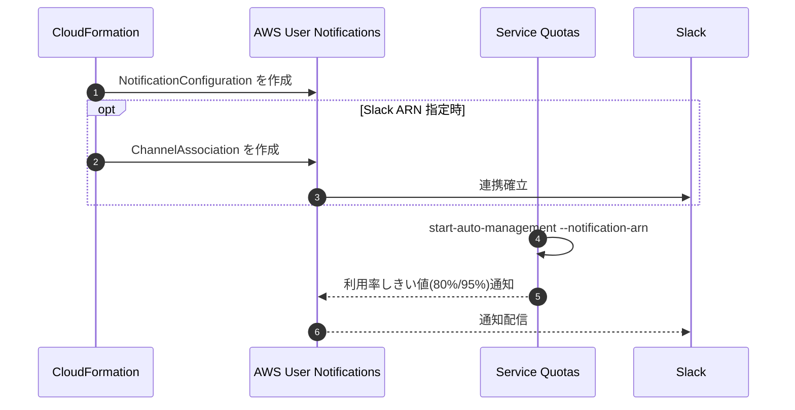

# Service Quotas Automatic Management + AWS User Notifications (CloudFormation)

Trusted Advisor ベースの監視をやめて、Service Quotas の Automatic Management と AWS User Notifications を使う構成です。

このディレクトリでは CloudFormation で AWS User Notifications の `NotificationConfiguration`（必要に応じて Slack 連携）を作成し、その ARN を `service-quotas start-auto-management --notification-arn` へ紐付けます。

SNS と CloudWatch Alarm は作成しません。

ブログの方針: https://blog.serverworks.co.jp/servicequotas_automatic_management

## 構成

この CloudFormation テンプレートは以下を作成します。

- AWS User Notifications の `NotificationConfiguration`
- （任意）AWS Chatbot Slack チャネルとの `ChannelAssociation`

その後、Service Quotas Automatic Management を CLI で有効化します。

## 構成図

draw.io ファイル: [docs/architecture.drawio](docs/architecture.drawio)

## 全体フロー



## 前提条件

- AWS CLI がインストールされていること
- 次の権限があること
  - `cloudformation:*`
  - `organizations:*`（Trusted access 有効化を含む）
  - `notifications:*`
  - `service-quotas:start-auto-management`
  - `service-quotas:update-auto-management`
  - `service-quotas:get-auto-management-configuration`
- StackSet は `SERVICE_MANAGED` モードを前提とすること
  - AWS Organizations が有効であること
  - CloudFormation StackSets の trusted access を有効化済みであること

## パラメータ（CloudFormation）

| パラメータ | 説明 | デフォルト値 |
|---|---|---|
| ServiceQuotaNotificationName | User Notifications 設定名 | service-quota-auto-management |
| ServiceQuotaNotificationDescription | User Notifications 設定の説明 | Notifications for Service Quotas Automatic Management |
| ServiceQuotaAggregationDuration | 通知集約期間（SHORT/LONG） | SHORT |
| ServiceQuotaSlackChannelArn | Slack チャネル ARN（任意） | (空) |

## AWS CLI でのデプロイ手順（SERVICE_MANAGED StackSet）

### 1. Trusted access を有効化（初回のみ）

```bash
aws organizations enable-aws-service-access \
  --service-principal member.org.stacksets.cloudformation.amazonaws.com
```

### 2. StackSet を作成または更新

```bash
REGION=ap-northeast-1
STACKSET_NAME=service-quota-monitoring

# 初回作成
aws cloudformation create-stack-set \
  --stack-set-name ${STACKSET_NAME} \
  --permission-model SERVICE_MANAGED \
  --auto-deployment Enabled=true,RetainStacksOnAccountRemoval=false \
  --template-body file://cfn/stackset-template.yaml \
  --parameters \
    ParameterKey=ServiceQuotaNotificationName,ParameterValue=service-quota-auto-management \
    ParameterKey=ServiceQuotaNotificationDescription,ParameterValue='Notifications for Service Quotas Automatic Management' \
    ParameterKey=ServiceQuotaAggregationDuration,ParameterValue=SHORT \
    ParameterKey=ServiceQuotaSlackChannelArn,ParameterValue=arn:aws:chatbot:us-east-1:123456789012:chat-configuration/slack-channel/my-channel \
  --capabilities CAPABILITY_NAMED_IAM \
  --region ${REGION}

# 既存 StackSet の更新時
aws cloudformation update-stack-set \
  --stack-set-name ${STACKSET_NAME} \
  --permission-model SERVICE_MANAGED \
  --auto-deployment Enabled=true,RetainStacksOnAccountRemoval=false \
  --template-body file://cfn/stackset-template.yaml \
  --parameters \
    ParameterKey=ServiceQuotaNotificationName,ParameterValue=service-quota-auto-management \
    ParameterKey=ServiceQuotaNotificationDescription,ParameterValue='Notifications for Service Quotas Automatic Management' \
    ParameterKey=ServiceQuotaAggregationDuration,ParameterValue=SHORT \
    ParameterKey=ServiceQuotaSlackChannelArn,ParameterValue=arn:aws:chatbot:us-east-1:123456789012:chat-configuration/slack-channel/my-channel \
  --capabilities CAPABILITY_NAMED_IAM \
  --region ${REGION}
```

### 3. StackSet インスタンスを OU に展開

```bash
# 例: Organizations OU へ展開
aws cloudformation create-stack-instances \
  --stack-set-name ${STACKSET_NAME} \
  --deployment-targets OrganizationalUnitIds=ou-xxxx-xxxxxxxx \
  --regions ap-northeast-1 us-east-1 \
  --operation-preferences FailureToleranceCount=0,MaxConcurrentCount=5 \
  --region ${REGION}
```

### 4. 各対象アカウントで NotificationConfigurationArn を取得

StackSet は通知設定を配布するだけなので、Service Quotas の有効化はアカウントごとに実行します。各対象アカウントで次を実行してください。

```bash
NOTIFICATION_ARN=$(aws notifications list-notification-configurations \
  --region ${REGION} \
  --query "NotificationConfigurations[?Name=='service-quota-auto-management'].Arn | [0]" \
  --output text)

echo ${NOTIFICATION_ARN}
```

### 5. 各対象アカウントで Service Quotas Automatic Management を有効化

```bash
aws service-quotas start-auto-management \
  --opt-in-level ACCOUNT \
  --opt-in-type NotifyOnly \
  --notification-arn ${NOTIFICATION_ARN} \
  --region ${REGION}
```

すでに有効化済みの場合は `update-auto-management` を使用します。

```bash
aws service-quotas update-auto-management \
  --opt-in-type NotifyOnly \
  --notification-arn ${NOTIFICATION_ARN} \
  --region ${REGION}
```

除外リストを使う場合の例:

```bash
aws service-quotas update-auto-management \
  --opt-in-type NotifyOnly \
  --notification-arn ${NOTIFICATION_ARN} \
  --exclusion-list '{"dynamodb":["L-E123ABC4"]}' \
  --region ${REGION}
```

### 6. 設定確認

```bash
aws cloudformation describe-stack-set --stack-set-name ${STACKSET_NAME} --region ${REGION}
aws cloudformation list-stack-instances --stack-set-name ${STACKSET_NAME} --region ${REGION}
aws notifications list-notification-configurations --region ${REGION}
aws service-quotas get-auto-management-configuration --region ${REGION}
```

## クリーンアップ

```bash
# 先に StackSet インスタンスを削除
aws cloudformation delete-stack-instances \
  --stack-set-name ${STACKSET_NAME} \
  --deployment-targets OrganizationalUnitIds=ou-xxxx-xxxxxxxx \
  --regions ap-northeast-1 us-east-1 \
  --no-retain-stacks \
  --region ${REGION}

# その後 StackSet を削除
aws cloudformation delete-stack-set --stack-set-name ${STACKSET_NAME} --region ${REGION}
```

## 参考資料

- Service Quotas Automatic Management
  - https://docs.aws.amazon.com/servicequotas/latest/userguide/automatic-management.html
- Getting started with Service Quotas Automatic Management
  - https://docs.aws.amazon.com/servicequotas/latest/userguide/getting-started-auto-mgmt.html
- Updating Service Quotas Automatic Management configuration
  - https://docs.aws.amazon.com/servicequotas/latest/userguide/updating-automatic-management.html
- AWS::Notifications::NotificationConfiguration
  - https://docs.aws.amazon.com/AWSCloudFormation/latest/TemplateReference/aws-resource-notifications-notificationconfiguration.html
- AWS User Notifications
  - https://docs.aws.amazon.com/notifications/latest/userguide/what-is-service.html
